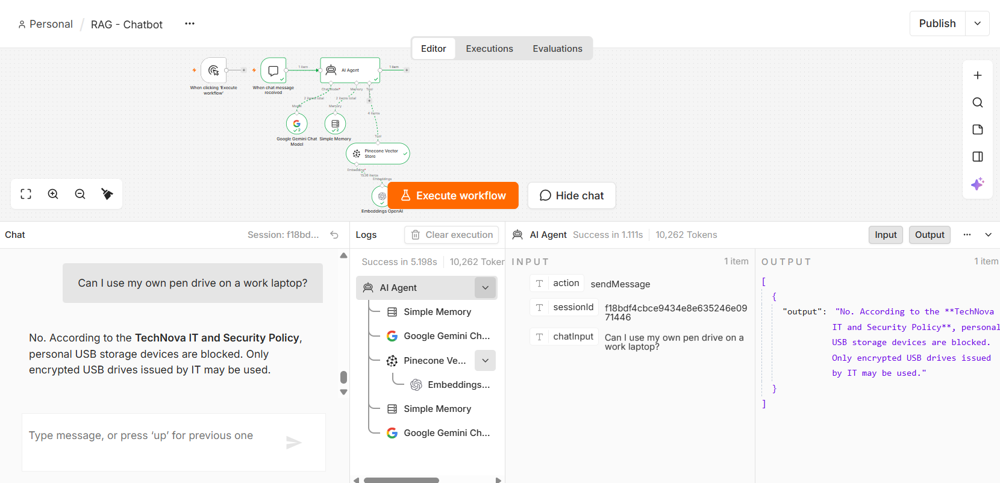

# RAG Chatbot for Document Q&A (n8n)

A document question-answering chatbot built in **n8n** using Retrieval-Augmented Generation (RAG). It answers questions only from uploaded PDF documents and politely declines questions that are not covered by them.

**Demo video:** [add link here]

## Overview

The project has two separate n8n workflows that share one Pinecone vector index:

1. **Ingestion workflow:** upload a PDF, split it into chunks, convert chunks to embeddings, and store them in Pinecone.
2. **Chat workflow:** a user question goes to an AI Agent, which searches Pinecone for relevant chunks and answers using only what it found.

## Architecture

```
WORKFLOW A (Ingestion)
  n8n Form Trigger -> Pinecone Vector Store (Insert)
                        + Embeddings OpenAI (text-embedding-3-small)
                        + Default Data Loader <- Recursive Character Text Splitter

WORKFLOW B (Chat)
  Chat Trigger -> AI Agent
                    + Chat Model (Google Gemini)
                    + Simple Memory
                    + Pinecone Vector Store (as Tool) <- Embeddings OpenAI
```

Add screenshots here:




## Tech stack

| Part | Tool |
|---|---|
| Automation | n8n Cloud |
| Vector database | Pinecone (index `rag-docs`, dense, 1536 dimensions, cosine) |
| Embeddings | OpenAI `text-embedding-3-small` |
| Chat model | Google Gemini (Flash model, temperature 0.2) |
| Memory | n8n Simple Memory (last 5 exchanges) |

## Design decisions

- **Two workflows, not one:** ingestion runs only when a document is added, while chat runs on every question. Separate workflows are easier to debug and use fewer executions.
- **Same embedding model in both workflows:** the vectors stored and the vectors searched must come from the same model, and the index dimension (1536) must match it.
- **Chunking:** 1000 characters with 200 overlap, so ideas stay together and sentences are not cut at chunk edges.
- **Retrieval:** top 4 chunks returned to the agent, with source file name stored as metadata.
- **Hallucination control:** the system prompt requires the agent to search first, answer only from retrieved text, and reply "I couldn't find that in the documents." otherwise. Low temperature (0.2) reduces invented details.

## Repository structure

```
.
├── README.md
├── workflows/
│   ├── RAG-Ingestion.json
│   └── RAG-Chatbot.json
├── documents/
│   ├── TechNova_Employee_Handbook.pdf
│   ├── TechNova_IT_Security_Policy.pdf
│   └── NovaDesk_Customer_FAQ.pdf
├── docs/
│   └── RAG_Chatbot_n8n_Build_Guide.pdf
├── test-results/
│   └── rag-chatbot-test-results.csv
└── screenshots/
```

The three PDFs are fictional documents written for this project, so every answer can be checked against a known fact.

## Setup

1. Create a Pinecone index named `rag-docs` with **1536 dimensions** and **cosine** metric.
2. In n8n, import `workflows/RAG-Ingestion.json` and `workflows/RAG-Chatbot.json` (three dots menu, then Import from file).
3. Create credentials for **Pinecone**, **OpenAI**, and **Google Gemini**, and select them in the Pinecone, Embeddings, and Chat Model nodes. API keys are not included in the exported workflows.
4. Run the ingestion workflow and upload each PDF from `documents/` once.
5. Open the chat workflow, click **Open Chat**, and ask a question such as: *How many casual leaves do employees get per year?*

## Test results

A 20-question evaluation set was written with expected answers and scored pass/fail against a written rubric.

| Question type | Count | Result |
|---|---|---|
| Direct fact | 9 | All passed |
| Multi-part / calculation | 4 | All passed |
| Cross-document | 3 | All passed |
| Out of scope (should decline) | 3 | All passed |
| Follow-up (memory) | 1 | Passed |
| **Total** | **20** | **20/20** |

Full question list, expected answers, and bot answers: `test-results/rag-chatbot-test-results.csv`.

## Limitations

- Small, self-authored test set on three short fictional documents.
- Not tested on scanned (image-only) PDFs, very large documents, or tables with complex layouts.
- Uploading the same file twice creates duplicate vectors; there is no deduplication step yet.

## Possible improvements

- Auto-ingest new files from Google Drive.
- Duplicate protection using a log of ingested files.
- Source citations in every answer.
- Telegram or WhatsApp front end.
- Error-handling workflow with alerts.

## Author

[Your name] | [LinkedIn or email]
